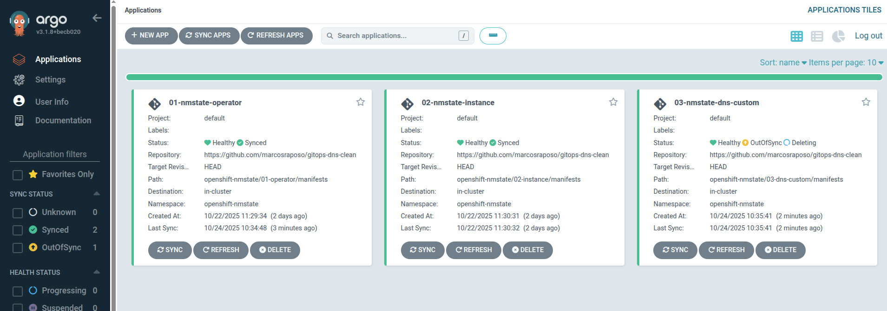

## Practical Guide: Managing Custom DNS Configuration with NMState and ArgoCD Hooks

## Introduction

This guide details a robust GitOps approach for injecting custom DNS resolvers into OpenShift cluster nodes using the **NMState Operator (Node Network Configuration Policy)**. We will focus on a single ArgoCD Application to manage the configuration and, crucially, implement an automated cleanup mechanism using an **ArgoCD PostDelete Hook Job**.

This solution addresses a known NMState behavior: the need to explicitly apply an empty state configuration to truly remove previous settings.

## Prerequisites and Environment

This article is based on a structured GitOps repository design that separates the Operator, Instance, and Configuration layers. However, we will focus only on deploying the **Configuration layer (`03-dns-custom`)**.

**Assumptions (Prerequisites MUST be complete):**

1.  **OpenShift Cluster** is running.
2.  **ArgoCD** is installed in the `openshift-gitops` namespace.
3.  **NMState Operator and Instance** are installed and running successfully in the `openshift-nmstate` namespace.
4.  The **`nmstate-clean-job` ServiceAccount** and its necessary permissions for the cleanup Job must exist as a prerequisite (it is part of the foundational **`01-operator`** Application layer in the repository structure).

### ArgoCD Permissions Prerequisite

To allow the ArgoCD Application Controller to create the necessary NMState objects (`NodeNetworkConfigurationPolicy`) and the cleanup `Job`, the following permissions must be pre-configured:

```yaml
apiVersion: rbac.authorization.k8s.io/v1
kind: ClusterRole
metadata:
  name: argocd-nmstate-manager # Descriptive Role name
rules:
- apiGroups: ["nmstate.io"] # The API group for NMState objects
  resources: ["*"]
  verbs: ["*"] # Permissions to manage NMState resources (NNCP)
- apiGroups: ["batch"] # The API group for Jobs
  resources: ["jobs"]
  verbs: ["*"] # Permissions to create and manage the cleanup Job
- apiGroups: [""] # Core API group for ServiceAccounts
  resources: ["serviceaccounts"] 
  verbs: ["create", "get", "list", "watch", "update", "patch", "delete"] 

---

apiVersion: rbac.authorization.k8s.io/v1
kind: ClusterRoleBinding
metadata:
  name: argocd-nmstate-binding # Descriptive Binding name
subjects:
- kind: ServiceAccount
  name: openshift-gitops-argocd-application-controller # The ServiceAccount used by the ArgoCD controller
  namespace: openshift-gitops # The Namespace where ArgoCD is installed
roleRef:
  kind: ClusterRole
  name: argocd-nmstate-manager # The ClusterRole created above
  apiGroup: rbac.authorization.k8s.io
```

-----

## Step 1: Git Repository Structure

The complete repository structure is designed for a layered deployment (e.g., via App of Apps), but **we will only be applying the `03-dns-custom` component**.

```bash
├── openshift-nmstate
│   ├── 01-operator                 # Contains NMState Operator and Job RBAC (Prerequisite)
│   │   ├── 01- application-operator.yaml
│   │   └── manifests
│   │       ├── clean-nncp-sa-cr-crb.yaml # ServiceAccount and RBAC for Cleanup Job
│   │       ├── cr-crb-argo.yaml         
│   │       └── ...
│   ├── 02-instance                 # Contains NMState Instance (Prerequisite)
│   │   ├── 02-application-instance.yaml
│   │   └── manifests
│   │       └── instance.yaml
│   └── 03-dns-custom               # OUR FOCUS: Configuration Layer
│       ├── 03-application-dns-custom.yaml # ArgoCD Application to manage DNS configuration
│       └── manifests
│           ├── clean-nncp-job.yaml        # The PostDelete Hook Job (Cleanup logic)
│           └── dns-custom.yaml            # NodeNetworkConfigurationPolicy (The DNS configuration)
```

-----

## Step 2: Custom DNS Configuration (`dns-custom.yaml`)

This file defines the desired state for the DNS resolvers, which NMState will enforce across the nodes.

**(NodeNetworkConfigurationPolicy - `dns-custom.yaml`)**

```yaml
apiVersion: nmstate.io/v1
kind: NodeNetworkConfigurationPolicy
metadata:
  name: dns-custom # Policy name
spec:
  desiredState:
    dns-resolver:
      config:
        search:
          - cluster.local # DNS search domains
        server:
          # Custom DNS servers to be applied to the nodes
          - 10.36.64.2
          - 10.36.41.51
```

-----

## Step 3: The Automated Cleanup Job (`clean-nncp-job.yaml`)

### The Removal Challenge

According to documentation, simply deleting the NNCP **does not remove the configuration from the node.** A subsequent NNCP must be applied with an empty state (`dns-resolver: config: {}`) to trigger the removal.

To automate this rollback, we implement a Job executed via a **`PostDelete` Hook**.

### The Cleanup Job Definition

This Job runs after the ArgoCD Application is deleted. It uses the pre-configured `nmstate-clean-job` ServiceAccount to execute the cleanup logic.

**(Cleanup Job - `clean-nncp-job.yaml`)**

```yaml
apiVersion: batch/v1
kind: Job
metadata:
  name: nmstate-cleanup
  namespace: openshift-nmstate 
  annotations:
    argocd.argoproj.io/hook: PostDelete          # Trigger this Job after the ArgoCD Application is deleted
    argocd.argoproj.io/hook-delete-policy: HookSucceeded # Delete the Job only if it finishes successfully
spec:
  template:
    spec:
      serviceAccountName: nmstate-clean-job # The ServiceAccount that MUST exist as a prerequisite for permissions
      restartPolicy: Never                  # Ensure the Pod does not restart if it fails
      containers:
      - name: yaml-generator-executor
        image: registry.redhat.io/openshift4/ose-cli:latest # Image with OpenShift CLI (oc)
        command: ["/bin/bash", "-c"]
        args:
          - | 
            echo "Starting DNS cleanup Job..."
            
            # 1. Write the YAML content to a file
            cat <<EOF > /tmp/dns-custom-cleanup.yaml
            apiVersion: nmstate.io/v1
            kind: NodeNetworkConfigurationPolicy
            metadata:
              name: dns-custom-cleanup
              namespace: openshift-nmstate
            spec: 
              desiredState: 
                dns-resolver:
                  config: {}  # Empty config forces NMState to remove previous custom settings
            EOF
            
            # Apply the temporary NNCP to initiate DNS cleanup
            oc apply -f /tmp/dns-custom-cleanup.yaml
            
            echo "Cleanup NNCP applied. Waiting 30 seconds for NMState to process..."
            sleep 30
            
            # 2. Delete the temporary cleanup policy
            echo "Removing the created cleanup NNCP"
            oc delete nncp dns-custom-cleanup --ignore-not-found=true
            
            echo "Custom DNS removal and NNCP cleanup completed successfully" 
```

### The Required RBAC for the Job (Prerequisite)

The `nmstate-clean-job` ServiceAccount (created by the `01-operator` Application) must have the following `ClusterRole` and `ClusterRoleBinding` to interact with NMState objects:

**(RBAC Snippet - `clean-nncp-sa-cr-crb.yaml`)**

```yaml
# ... (ServiceAccount definition - created by 01-operator) ...
---
apiVersion: rbac.authorization.k8s.io/v1
kind: ClusterRole
metadata:
  name: nmstate-clean-job-cr
rules:
- apiGroups: ["nmstate.io"] 
  resources: ["nodenetworkconfigurationpolicies"] 
  verbs: ["get", "list", "create", "delete", "watch"] # Required for the Job to create and delete the temporary NNCP
- apiGroups: [""] # Core API group for pods/log
  resources: ["pods","pods/log"]
  verbs: ["get", "list", "watch"]
---
kind: ClusterRoleBinding
apiVersion: rbac.authorization.k8s.io/v1
metadata:
  name: nmstate-clean-job-crb
subjects:
  - kind: ServiceAccount
    name: nmstate-clean-job
    namespace: openshift-nmstate
roleRef:
  apiGroup: rbac.authorization.k8s.io
  kind: ClusterRole
  name: nmstate-clean-job-cr
```

-----

## Step 4: Deployment and Verification

Before synchronizing the ArgoCD application, the `/etc/resolv.conf` on the cluster nodes typically shows only the default OpenShift DNS resolvers (e.g., the KubeVirt or OpenShift internal services). This is the state we aim to restore after the cleanup hook runs.


### Deployment

To initiate the GitOps flow, we create the ArgoCD Application, pointing to the DNS configuration path (`03-dns-custom`) in our repository.

**ArgoCD Application (Example: `03-application-dns-custom.yaml`)**

```yaml
apiVersion: argoproj.io/v1alpha1
kind: Application
metadata:
  name: 03-nmstate-dns-custom
  namespace: openshift-gitops  #Namespace where ArgoCD is installed
spec:
  destination:
    namespace: openshift-nmstate #Namespace where the NNCP and Job will be created
    name: in-cluster 
  source:
    path: openshift-nmstate/03-dns-custom/manifests # Path to dns-custom.yaml and clean-nncp-job.yaml
    repoURL: https://github.com/marcosraposo/gitops-dns-clean # Replace with your repository URL
    targetRevision: HEAD
  sources: []
  project: default
  syncPolicy:
    automated:
      prune: true
      selfHeal: true
```

1.  Create a new ArgoCD Application pointing to the **`openshift-nmstate/03-dns-custom`** path in your repository.
2.  Synchronize the Application (e.g., using the `03-application-dns-custom.yaml` definition).
3.  **Result:** The NNCP (`dns-custom.yaml`) and the cleanup Job (`clean-nncp-job.yaml`) are deployed. NMState enforces the NNCP, adding the custom DNS servers to the nodes.


### Verification of Successful Configuration

Once the ArgoCD Application is synced, we can confirm that the NMState Operator successfully created the policy and applied the network change to the cluster nodes.

**1. NMState Policy Creation in OpenShift:**

Check the OpenShift console or use the `oc` CLI to confirm the `NodeNetworkConfigurationPolicy` was created and is in a successful state.

```bash
oc get nncp dns-custom -n openshift-nmstate
```


**2. DNS Configuration Change on the Node:**

Access a node to verify the `/etc/resolv.conf` file was updated with the custom DNS server entries (`10.36.64.2` and `10.36.41.51`). 

```bash
# Example command to check resolv.conf on a master node
oc debug node/malima-sp4m8-master-0 -- chroot /host cat /etc/resolv.conf
```


-----

### Removal and Automated Cleanup

1.  In ArgoCD, execute the **Delete** operation on the Application (`03-application-dns-custom`).
2.  ArgoCD deletes the NNCP (`dns-custom.yaml`).
3.  The **`nmstate-cleanup` Job** is triggered by the `PostDelete` hook.
4.  The Job runs, applying the empty-state NNCP to revert the configuration before the Job itself finishes and is potentially deleted.



Check the job `nmstate-clean-job` was created 


The policy created only to run during the job runtime ensures the removal of the custom DNS entries.


After the job finishes the commands of clean, the application `03-dns-custom-config` has been deleted from the ArgoCD Dashboard, signifying the complete removal of the DNS configuration layer from the cluster.


**Verification:**

After the deletion process is complete and the `nmstate-cleanup` Job finishes successfully:

1.  Verify the `/etc/resolv.conf` on a cluster node (e.g., via `oc debug node/<node-name>`). The custom DNS entries (`10.36.x.x`) should be removed, confirming the successful automated rollback.
2.  Check if the temporary policy created during the job runtime was deleted.

The `resolv.conf` after nmstate-cleanup job


List of policies in NNCP


## Conclusion

By isolating the configuration into a dedicated ArgoCD Application and employing a **PostDelete Hook Job** with precise RBAC, we successfully overcome the NMState operator's limitation regarding configuration cleanup. This pattern ensures that the custom DNS settings are fully managed through GitOps: easy to apply and automatically cleaned up upon removal.